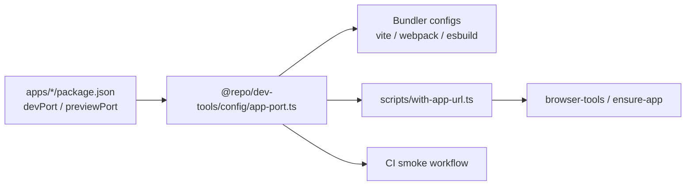

The **“cleanest long-term”** option means: **one TypeScript module in `@repo/dev-tools`, one standard way to run TS from Node everywhere else.** No `.js` + `.d.ts` pair, no `createRequire` workaround, no duplicated port logic.

## The target shape

```text
packages/dev-tools/config/
  paths.ts
  environment.ts
  app-port.ts          ← single source (like the other config modules)

scripts/
  with-app-url.ts      ← can stay TS too
  ensure-app.js        ← optional later migration

apps/*/config/*.ts     ← normal ESM import, same as environment.ts
```

Every consumer imports the same way:

```ts
import {
  resolveAppUrl,
  resolveAppPortFromPackage,
} from '@repo/dev-tools/config/app-port';
```

No `.js` suffix, no companion `.d.ts`, no webpack special case.

## The missing piece today

Your repo already has **two runtime worlds**:

| World                  | Examples                                                  | Can run `.ts` today?              |
| ---------------------- | --------------------------------------------------------- | --------------------------------- |
| **Bundler configs**    | `vite.config.ts`, `webpack.config.ts`, `dev.config.ts`    | Yes (Vite runner / `ts-node/esm`) |
| **Plain Node scripts** | `with-app-url.js`, Storybook spawn scripts, CI one-liners | No — only `node …`                |

`app-port.js` exists solely to bridge that gap. The long-term fix is **not** “keep `.js` forever” — it’s **teach the plain-Node world to run TypeScript the same way everywhere**.

## Recommended mechanism: `tsx` at the repo root

**`tsx`** is a small dev dependency that lets Node execute `.ts` directly:

```bash
tsx scripts/with-app-url.ts browser-tools validate …
```

Why `tsx` over more `ts-node/esm`:

- Your esbuild app already has a comment: _“if ts-node make too many issues … replace it with tsx”_
- `tsx` is simpler for **scripts** (no `NODE_OPTIONS='--loader ts-node/esm'`, no `TS_NODE_PROJECT=…`)
- Works for root scripts, app spawn scripts, and CI one-liners
- Bundler apps can keep their existing loaders for now, or migrate later independently

Pin it once at the **repo root** (or in the pnpm catalog):

```json
"devDependencies": {
  "tsx": "…"
}
```

## “Shared wrapper” — what that actually means

Instead of sprinkling `tsx` in many places by hand, centralize the invocation pattern.

### Option A — explicit in each script (simplest)

```json
"browser": "dotenv -- tsx scripts/with-app-url.ts browser-tools",
"browser:ensure-app": "dotenv -- tsx scripts/with-app-url.ts tsx scripts/ensure-app.ts"
```

Clear, grep-able, no magic.

### Option B — one env var for all TS scripts (DRYer)

Root `package.json`:

```json
"scripts": {
  "node:ts": "tsx",
  "browser": "dotenv -- pnpm node:ts scripts/with-app-url.ts browser-tools"
}
```

Or in `.env` / CI:

```bash
NODE_OPTIONS='--import tsx'
```

(use sparingly — global `NODE_OPTIONS` can surprise bundler apps)

### Option C — tiny runner script (most structured)

```json
"run:ts": "tsx"
```

And a convention in docs: **“repo maintenance scripts are `.ts` and run via `pnpm run:ts`.”**

That’s the “wrapper” — not a second copy of port logic, just a **single blessed command** for executing TS outside bundlers.

## End-to-end flow after migration



**Resolution contract stays the same:**

1. `APP_URL` set → use it
2. else `BUNDLER` → `http://localhost:<devPort>`
3. else error / require `--url`

Only the **module format and runner** change.

## Concrete file changes (when you implement)

| Change                                                             | Why                                      |
| ------------------------------------------------------------------ | ---------------------------------------- |
| `app-port.mjs/js` → `app-port.ts`                                  | Align with `paths.ts` / `environment.ts` |
| Delete `app-port.d.ts`                                             | Types live in the `.ts` file             |
| `with-app-url.js` → `.ts`                                          | Can import `app-port` normally           |
| Root `browser:*` scripts use `tsx`                                 | Loader for wrapper                       |
| Storybook/esbuild spawn scripts → `.ts` + `tsx` in `package.json`  | Same pattern                             |
| CI: `tsx -e "import …"` or a tiny `scripts/resolve-app-url.ts` CLI | Avoid fragile inline imports             |
| Webpack: revert `createRequire` → normal import                    | `.ts` behaves like `environment.ts`      |
| Vite/esbuild: drop `.js` suffix on import                          | Consistency                              |

`ensure-app.js` can stay JS for now — it only reads `process.env.APP_URL` and doesn’t import `app-port`.

## CI gets cleaner too

Instead of:

```bash
node --input-type=module -e "import { resolveAppPort } from './packages/dev-tools/config/app-port.js'; …"
```

Prefer a small script:

```bash
tsx scripts/print-app-url.ts
# or
pnpm exec tsx -e "import { resolveAppUrlFromBundler } from '@repo/dev-tools/config/app-port'"
```

Easier to test locally, lint, and typecheck.

## What you gain

- **One implementation** — no JS/d.ts drift
- **Consistent imports** across bundlers and tooling
- **Webpack fix becomes unnecessary** — the `.js` + ts-node rootDir issue goes away
- **Typecheck coverage** — `@repo/dev-tools check:type` validates `app-port.ts` with the rest
- **Future scripts** — new repo tooling can be `.ts` by default

## Costs / tradeoffs

- **New dev dependency** (`tsx`) at root (small, common in monorepos)
- **Script invocations change** — `node scripts/…` → `tsx scripts/…` in a handful of `package.json` entries
- **Agents/docs** must say “run via `tsx`” for those scripts
- **Not the same as a build step** — you’re not compiling `@repo/dev-tools` to `dist/`; TS runs at script time (fine for config/tooling)

## What this is _not_

- **Not** “convert everything to TS” — only modules that need shared typed logic and their direct runners
- **Not** replacing bundler loaders yet — webpack/esbuild can keep `ts-node/esm` until you optionally unify those too
- **Not** putting app URL back in `.env` — override policy stays **`APP_URL` only**

## Suggested rollout order

1. Add `tsx` to root devDependencies
2. Move `app-port.js` → `app-port.ts`, update bundler imports, remove webpack `createRequire`
3. Convert `with-app-url` to `.ts`, switch `browser:*` scripts to `tsx`
4. Convert Storybook/esbuild spawn scripts to `.ts`
5. Replace CI inline `node -e` with `tsx`
6. Update `AGENTS.md` / `browser-validation.md` (“resolved via `@repo/dev-tools/config/app-port`”)

Each step is independently shippable; step 1–3 already removes the awkward `.js` layer for the important paths.

---

**Bottom line:** the long-term design is **`app-port.ts` + `tsx` as the repo’s standard “run TypeScript tooling” command.** That unblocks plain Node consumers without a build pipeline, and makes `@repo/dev-tools` internally consistent.

If you want to implement this, the main decision is **Option A vs B vs C** for how centralised `tsx` invocation should be — I’d recommend **Option A** (explicit `tsx` in each script) unless you expect many more TS scripts soon, in which case **Option C** (`pnpm run:ts`) scales nicer.
