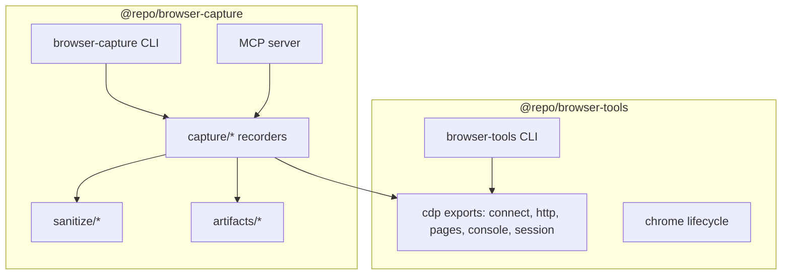

# Plan: Refactor `@repo/browser-capture` + shared CDP (Option A)

**Status:** Phase 2 done — continue at Phase 3  
**Branch:** `develop`  
**Created:** 2026-06-20  
**Phase 1 completed:** 2026-06-21  
**Phase 2 completed:** 2026-06-21

## How to run (new chat)

Attach or `@`-mention this file — no need to paste instructions separately.

**Minimal prompt:**

```text
Execute .ai/plans/browser-capture-refactor.md — start at Phase 3.
```

**Full agent instructions** (also at top so the file is self-contained):

```text
Implement this plan. Read AGENTS.md first.

- Turborepo monorepo, branch develop.
- Approved: Option A (shared CDP in @repo/browser-tools), rename binary to browser-capture,
  add --attach to capture, root pnpm capture:* scripts, MCP via .rulesync/mcp.json + pnpm sync:agents.
- Do NOT replace packages with external npm tools.
- Execute phase-by-phase; run pnpm lint, pnpm test, pnpm check:type after each phase.
- Start with Phase 3 unless I specify a different phase.

If the plan is already partially done, read git status and skip completed tasks.
```

---

## Executive summary

Split the ~1,737-line monolith `packages/browser-capture/bin/copilot-devtools.js` into a modular `src/` layout (mirroring `@repo/browser-tools`), share CDP primitives via **Option A** (extend `@repo/browser-tools` exports), rename the CLI binary to `browser-capture`, add **`--attach`** to capture commands that navigate, add root **`pnpm capture:*`** scripts, and update MCP via **`.rulesync/mcp.json`** (then `pnpm sync:agents`).

**Do not replace these packages with external npm tools.** They are repo-specific orchestration (artifact layout, sanitization policy, CI, APP_URL wiring, agent skills). External tools already in use: `playwright-core`, `chrome-devtools-mcp` (verify MCP tier).

---

## Decisions (locked in)

| #   | Decision                                                                                                                          |
| --- | --------------------------------------------------------------------------------------------------------------------------------- |
| 1   | **Option A** — shared CDP lives in `@repo/browser-tools`; `@repo/browser-capture` depends on it                                   |
| 2   | **Rename binary** — `copilot-devtools` → `browser-capture`                                                                        |
| 3   | **Add `--attach`** — capture commands that navigate can reuse the visible tab (same semantics as `browser-tools --attach`)        |
| 4   | **Root scripts** — add `pnpm capture:*` wrappers (parallel to `pnpm browser:*`)                                                   |
| 5   | **MCP config** — edit `.rulesync/mcp.json` only; run `pnpm sync:agents`; do not hand-edit `.cursor/mcp.json` / `.vscode/mcp.json` |
| 6   | **Keep internal** — do not publish to npm; do not adopt `@playwright/mcp` as a third MCP server                                   |

---

## Current state

### `@repo/browser-tools` (reference architecture)

```
packages/browser-tools/
  bin/browser.js          # thin CLI router
  bin/chrome.js           # Chrome lifecycle
  bin/setup.js            # ensure Chrome + tab
  src/cli/args.js         # parseArgs (unit tested)
  src/cli/bin-names.js
  src/cdp/connect.js      # connectOverCDP
  src/cdp/session.js      # withPageSession, withAttachedSession
  src/cdp/tabs.js         # openUrl, findPageAtOrigin
  src/chrome/lifecycle.js
  src/cdp/assert.js, read.js, snapshot/
```

### `@repo/browser-capture` (after Phase 2)

```
packages/browser-capture/
  bin/copilot-devtools.js   # thin router (~97 lines) — rename in Phase 3
  src/                      # modular capture, sanitize, cli, mcp, inject, artifact-io, …
  __tests__/                # 36 unit tests (vitest)
  vitest.config.ts
  package.json              # bin: copilot-devtools (rename in Phase 3)
  README.md, SECURITY.md, CHANGELOG.md
  artifacts/                # gitignored capture output
```

**Deviations from original target layout (intentional):**

- `src/artifact-io/` instead of `src/artifacts/` — avoids `.gitignore` collision with output `artifacts/`
- `src/inject/*.inject.js` + `paths.js` — file-based `addInitScript({ path })`, not template-literal strings
- No local `src/cdp/` — CDP via `@repo/browser-tools/cdp` (Phase 2)

### Tier model (do not break)

| Tier    | Package / tool                                  | Use for                                    |
| ------- | ----------------------------------------------- | ------------------------------------------ |
| Verify  | `@repo/browser-tools`, `chrome-devtools` MCP    | DOM assertions — no capture artifacts      |
| Capture | `@repo/browser-capture`, `devtools-capture` MCP | HAR, traces, Web Vitals, console artifacts |

---

## Target architecture



### Target file layout — `browser-capture`

```
packages/browser-capture/
  bin/browser-capture.js          # thin router (~80 lines)
  src/
    cli/
      args.js                     # resolveDurationMs, requireUrl, captureOptions (--attach, --no-sanitize)
      usage.js
    capture/
      snapshot.js
      trace.js
      performance.js
      console.js
      interactions.js
    artifact-io/                  # was artifacts/ — avoids gitignore collision
      paths.js, metadata.js, write.js, upload.js
    inject/
      performance-observer.inject.js
      interaction-recorder.inject.js
      paths.js
    performance/
      metrics.js
    interactions/
      source-map.js, locator.js, test-generator.js
    sanitize/
      index.js
      har.js
      console.js
      interactions.js
      redact.js
    mcp/
      server.js
      tools.js
  __tests__/
    sanitize.test.js
    args.test.js
    locator.test.js
    test-generator.test.js
  vitest.config.ts
```

### Target exports — `browser-tools` (Option A)

Add to `packages/browser-tools/package.json`:

```json
{
  "exports": {
    "./cdp": "./src/cdp/index.js",
    "./cli/args": "./src/cli/args.js"
  }
}
```

Extend `src/cdp/index.js` (or add modules) with:

| Module       | Purpose                                                                                                                        |
| ------------ | ------------------------------------------------------------------------------------------------------------------------------ |
| `connect.js` | Already exists — `connectOverCDP(port?, host?)`                                                                                |
| `http.js`    | **New** — `fetchCdpJson(path)` for `/json/version`, `/json/list` (use `fetch`, match `lifecycle.js` pattern)                   |
| `pages.js`   | **New** — `findPageAtOrigin(browser, url)` (move from `tabs.js`), `findRecentPage(browser)` (from capture's `getExistingPage`) |
| `console.js` | **New** — `attachConsoleListeners(page, { mode: 'errors' \| 'full' })`                                                         |
| `session.js` | Existing — `withPageSession`, `withAttachedSession`                                                                            |

Refactor `session.js` to use shared `console.js` internally (behavior unchanged).

Env resolution: export constants or helper for `CHROME_DEBUG_PORT` (default 9222) and `CHROME_DEBUG_HOST` (default `localhost`).

---

## Phased execution

Execute as **separate PRs** when possible. Each phase ends with quality gate.

### Phase 1 — Decompose monolith (no shared deps yet) ✅ DONE

**Goal:** Same behavior, modular files, unit tests. Binary name can stay `copilot-devtools` temporarily to reduce diff noise, or rename in Phase 3 only — **prefer rename in Phase 3** so Phase 1 is pure refactor.

**Completed:**

1. ✅ `src/` tree; monolith split into modules (behavior preserved)
2. ✅ `bin/copilot-devtools.js` thin router
3. ✅ `vitest.config.ts` + `__tests__/` (sanitize, args, locator, test-generator) — 36 tests
4. ✅ `package.json` test scripts + vitest devDependency
5. ✅ MCP server paths updated; functional
6. ✅ Post-Phase-1 fixes: `src/artifact-io/` (gitignore-safe), inject as `*.inject.js` files

**Verification (passed):**

```bash
pnpm --filter @repo/browser-capture test   # 36 passed
pnpm lint && pnpm test && pnpm check:type  # green
# Manual: capture-snapshot / record-trace with chrome:debug + dotenv URL resolution
```

---

### Phase 2 — Shared CDP in `@repo/browser-tools` ✅ DONE

**Goal:** Remove duplication; capture imports from tools.

**Completed:**

1. ✅ Added `src/cdp/http.js`, `pages.js`, `console.js`, `constants.js`
2. ✅ Updated `src/cdp/index.js` exports
3. ✅ Added `exports` field to `browser-tools/package.json` (`./cdp`, `./cli/args`)
4. ✅ Refactored `session.js`, `tabs.js` to use shared modules (CLI behavior unchanged)
5. ✅ Added `@repo/browser-tools: workspace:*` to `browser-capture/package.json`
6. ✅ Capture imports: `parseArgs`, `connectOverCDP`, `fetchCdpJson`, `findRecentPage`, `attachConsoleListeners`
7. ✅ Unit tests in `browser-tools` for `http.js` and `pages.js` (33 tests total)
8. ✅ Removed `browser-capture/src/cdp/connect.js` and `http.js`

**Verification (passed):**

```bash
pnpm --filter @repo/browser-tools test   # 33 passed
pnpm --filter @repo/browser-capture test # 36 passed
pnpm lint && pnpm test && pnpm check:type
```

---

### Phase 3 — Rename binary + MCP (rulesync)

**Goal:** `browser-capture` binary; MCP points to new path.

**Tasks:**

1. Rename `bin/copilot-devtools.js` → `bin/browser-capture.js`.
2. Update `packages/browser-capture/package.json`:
   ```json
   "bin": {
     "browser-capture": "./bin/browser-capture.js"
   }
   ```
3. Update `.rulesync/mcp.json`:
   ```json
   "devtools-capture": {
     "command": "node",
     "args": [
       "packages/browser-capture/bin/browser-capture.js",
       "mcp-server"
     ],
     "env": { "CHROME_DEBUG_PORT": "9222" }
   }
   ```
4. Run `pnpm sync:agents` and commit generated `.cursor/mcp.json`, `.vscode/mcp.json`, etc.
5. Update strings: MCP server `name` can stay `copilot-devtools` or become `browser-capture` (pick one; prefer **`browser-capture`** for consistency).
6. Update generated test file header: `// Generated by browser-capture record-interactions`.
7. Grep repo for `copilot-devtools` and update all references (list below).

**Files to update (grep `copilot-devtools`):**

- `packages/browser-capture/README.md`
- `packages/browser-capture/CHANGELOG.md`
- `packages/browser-capture/SECURITY.md`
- `.rulesync/skills/x-browser-capture/SKILL.md`
- `.github/workflows/capture-devtools.yml`
- `.github/workflows/verify-browser-smoke.yml`
- `.github/workflows/verify-browser-perf.yml`
- `.rulesync/rules/copilot-instructions.md` (if path mentioned)
- `.ai/plans/capture-ci-integration.md` (optional — historical plan)

**Verification:**

```bash
pnpm check:agents
pnpm sync:agents   # should be clean after commit
# Restart MCP / confirm devtools-capture server starts
node packages/browser-capture/bin/browser-capture.js mcp-server  # stdio — Ctrl+C after "started"
```

---

### Phase 4 — `--attach` for capture

**Goal:** Navigate-based capture commands can attach to the visible tab (preserve auth/session).

**Commands to support `--attach`:**

| Command               | Default today                     | With `--attach`                                                                                        |
| --------------------- | --------------------------------- | ------------------------------------------------------------------------------------------------------ |
| `record-trace`        | `browser.newContext()` + navigate | `withAttachedSession` — **do not navigate**; record on current page OR navigate only if explicit flag? |
| `record-performance`  | new context + navigate            | same                                                                                                   |
| `record-interactions` | new context + navigate            | same                                                                                                   |
| `record-console`      | already uses existing tab         | `--attach` optional/no-op or match by origin                                                           |
| `capture-snapshot`    | HTTP only                         | N/A                                                                                                    |

**Align with browser-tools semantics** (from `packages/browser-tools/README.md`):

- `--attach` matches tab by **origin** of URL
- Does **not** navigate — inspects/records current page
- Error hint: run `browser-tools open --url <url>` first

**Implementation:**

1. Add `--attach` to capture CLI args (`src/cli/args.js` → `captureOptions()`).
2. For `record-trace`, `record-performance`, `record-interactions`:
   - **Without `--attach`:** keep current isolated `newContext()` behavior (CI-friendly).
   - **With `--attach`:** use `withAttachedSession(url, fn)` from `@repo/browser-tools/cdp`; skip `page.goto` when attaching; still run duration wait + artifact write.
3. Document in `packages/browser-capture/README.md`.
4. MCP tools: add optional `attach: boolean` to zod schemas where relevant (default `false`).
5. Update `.rulesync/skills/x-browser-capture/SKILL.md` + `pnpm sync:agents`.

**Edge cases:**

- HAR/trace on attach: use existing context's page; tracing/HAR may need context from attached page's browser context — test manually with authenticated tab.
- If attach + URL origin mismatch → same error as browser-tools.

**Verification:**

```bash
pnpm browser:setup
pnpm browser open --url "$(pnpm exec dev-tools-app-target url)"
pnpm browser-capture record-console --attach --duration 3   # after root scripts exist
# Or: node packages/browser-capture/bin/browser-capture.js record-performance URL --attach --duration 3
```

---

### Phase 5 — Root `pnpm capture:*` scripts

**Goal:** Mirror `pnpm browser:*` ergonomics with APP_URL injection.

**Add to root `package.json`:**

```json
{
  "devDependencies": {
    "@repo/browser-capture": "workspace:*"
  },
  "scripts": {
    "capture:snapshot": "dotenv -- dev-tools-app-target run browser-capture capture-snapshot",
    "capture:trace": "dotenv -- dev-tools-app-target run browser-capture record-trace",
    "capture:performance": "dotenv -- dev-tools-app-target run browser-capture record-performance",
    "capture:console": "dotenv -- dev-tools-app-target run browser-capture record-console",
    "capture:interactions": "dotenv -- dev-tools-app-target run browser-capture record-interactions",
    "capture:upload": "dotenv -- browser-capture upload-artifacts"
  }
}
```

**Notes:**

- `record-*` commands need URL — either pass as extra args (`pnpm capture:trace -- http://localhost:5173`) or teach CLI to use `APP_URL` when URL positional omitted (align with browser-tools `resolveUrl`).
- Consider extending capture CLI: if URL positional missing, use `process.env.APP_URL` then `CAPTURE_URL` (document precedence).
- Update `AGENTS.md`, root `README.md`, capture skill, `packages/browser-capture/README.md`.

**Verification:**

```bash
pnpm browser:ensure-app
pnpm chrome:debug
pnpm capture:snapshot
pnpm capture:trace -- "$(pnpm exec dev-tools-app-target url)" --duration 3
```

---

## Quality gate (every phase)

From `AGENTS.md` / workspace rules:

```bash
pnpm lint
pnpm test
pnpm check:type
pnpm check:agents   # when .rulesync/** changed
```

For capture changes specifically:

```bash
pnpm --filter @repo/browser-capture test
pnpm --filter @repo/browser-tools test
```

---

## Behavior that must NOT change

1. **Artifact paths:** `packages/browser-capture/artifacts/<mode>-<timestamp>/`
2. **Artifact filenames:** `metadata.json`, `har.json`, `trace.zip`, `console.json`, `performance.json`, `interactions.json`, `generated.test.ts`
3. **Automatic sanitization** before write (unless `--no-sanitize`)
4. **`SECURITY.md` policy** — allowlist + PII patterns unchanged unless explicitly requested
5. **MCP tool names:** `capture_snapshot`, `record_trace`, `record_performance`, `record_console`, `record_interactions`, `sanitize_artifacts` (snake_case)
6. **Verify vs capture tier separation** in skills and docs
7. **CI workflows** must keep working (update paths only)

---

## Optional follow-ups (out of scope unless requested)

- Replace `chrome/lifecycle.js` with `chrome-launcher` npm package
- Use `pw-sanitizer` for trace zip post-processing (partial overlap only)
- Add `@repo/browser-tools` MCP server (README TODO)
- `browser-tools check-spec` command

---

## Reference links (in repo)

| Doc                                              | Purpose                         |
| ------------------------------------------------ | ------------------------------- |
| `AGENTS.md`                                      | Commands, Node 24, quality loop |
| `packages/browser-tools/README.md`               | `--attach`, CLI flags           |
| `packages/browser-capture/README.md`             | Capture commands, artifacts     |
| `packages/browser-capture/SECURITY.md`           | Sanitization contract           |
| `.rulesync/skills/x-browser-capture/SKILL.md`    | Agent capture workflow          |
| `.rulesync/skills/x-browser-validation/SKILL.md` | Verify tier (do not mix)        |
| `docs/browser-validation.md`                     | URL derivation, edge cases      |
| `.github/workflows/capture-devtools.yml`         | CI capture                      |
| `.github/workflows/verify-browser-smoke.yml`     | Smoke + optional trace          |
