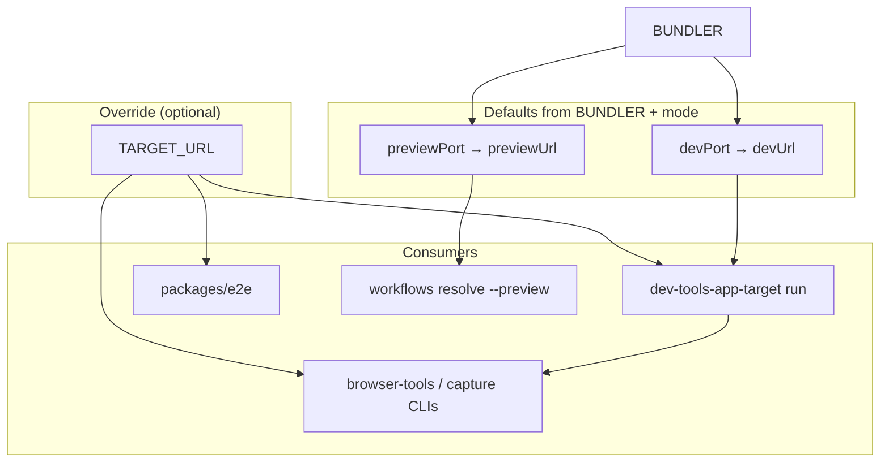

# Plan: Unify browser target URL resolution (`TARGET_URL`)

**Status:** Not started  
**Branch:** `develop`  
**Created:** 2026-06-24  
**Related:** [e2e-playwright.md](./e2e-playwright.md) (Phase 1 workaround in `packages/e2e/playwright.config.ts`)

## How to run (new chat)

Attach or `@`-mention this file — no need to paste instructions separately.

**Minimal prompt:**

```text
Implement the TARGET_URL plan in .ai/plans/target-url-unification.md. Read AGENTS.md first.
```

**Full agent instructions:**

```text
Implement this plan. Read AGENTS.md first.

- Turborepo monorepo, branch develop.
- One resolution model everywhere: TARGET_URL override → mode default (dev | preview).
- Rename APP_URL → TARGET_URL; remove APP_URL after deprecation window.
- Do not store TARGET_URL in committed .env — ports live in apps/*/package.json.
- Execute phase-by-phase; run pnpm lint, pnpm test, pnpm check:type after each phase.
- Update docs and cross-link e2e-playwright.md when E2E config is simplified.

If the plan is already partially done, read git status and skip completed tasks.
```

---

## Executive summary

Today **`APP_URL` means different things in different layers**:

| Layer                                           | Current behavior                                                   |
| ----------------------------------------------- | ------------------------------------------------------------------ |
| `@repo/dev-tools/config/app-port`               | Override in **dev** mode only; preview ignores it                  |
| `dev-tools-app-target run`                      | Injects resolved **dev** URL into `APP_URL` for child processes    |
| `@repo/browser-tools` / `@repo/browser-capture` | Generic “target URL” (`--url` → `APP_URL` → error / `CAPTURE_URL`) |
| `@repo/e2e`                                     | Duplicates override logic because preview mode skips `APP_URL`     |

That split forces special cases (E2E guard), confuses adopters (“is `APP_URL` dev or preview?”), and contradicts docs that tell users to set `APP_URL` for preview/remote overrides.

**Target:** rename to **`TARGET_URL`**, apply **one resolution rule** everywhere, remove workarounds.

---

## Problem (why change)

1. **Name lies** — `APP_URL` sounds universal; `run` injects dev URL; preview resolver ignores it.
2. **Split semantics** — resolver vs CLI vs E2E disagree on when override applies.
3. **Workarounds multiply** — every preview consumer re-implements “check override first”.
4. **Stale-override fear is overstated** — preview CI/scripts should unset override or pass `--url`; child injection via `run` does not pollute parent shell.

---

## Target model (locked in)

### Resolution order (all consumers)

```text
1. TARGET_URL set     → use as-is (any mode: dev, preview, remote, Storybook canvas)
2. mode === 'dev'     → BUNDLER + devPort   from apps/<BUNDLER>/package.json
3. mode === 'preview' → BUNDLER + previewPort from apps/<BUNDLER>/package.json
4. else               → null (caller errors with actionable hint)
```

**Mode controls the default, not whether an override applies.**

### Env var contract

| Variable          | Role                                                              | In `.env`?                                           |
| ----------------- | ----------------------------------------------------------------- | ---------------------------------------------------- |
| **`TARGET_URL`**  | Explicit browser/E2E target override                              | **No** — ephemeral (shell, CI step, `run` injection) |
| **`BUNDLER`**     | Which app’s `package.json` ports to use for defaults              | Yes                                                  |
| **`CAPTURE_URL`** | Capture-only secondary fallback when no positional / `TARGET_URL` | Optional local default; keep for capture tier        |

Do **not** rename `BUNDLER` or move ports into env. `apps/*/package.json` (`devPort` / `previewPort`) stays SSOT.

### `dev-tools-app-target run` behavior

Unchanged ergonomics, clearer injection:

1. If **`TARGET_URL` already set** in parent env → pass through to child (user override wins).
2. Else resolve **`mode: 'dev'`** default from `BUNDLER` → inject as **`TARGET_URL`** on child env.
3. Child CLIs read `TARGET_URL`; no second resolution path.

Optional follow-up (out of scope unless requested): `dev-tools-app-target run --preview` to inject preview default instead of dev.

### CLI URL chains (after migration)

| Tool                      | Chain                                                                      |
| ------------------------- | -------------------------------------------------------------------------- |
| **browser-tools**         | `--url` → `TARGET_URL` → error                                             |
| **browser-capture**       | positional → `TARGET_URL` → `CAPTURE_URL` → error                          |
| **app-port / app-target** | `resolveAppUrl(env, mode)` implements unified order above                  |
| **E2E Playwright**        | `baseURL: resolveAppUrl(process.env, 'preview')` — no local override guard |

### Type / source renames in `app-port.ts`

```typescript
source: 'TARGET_URL' | 'BUNDLER'; // was 'APP_URL' | 'BUNDLER'
```

Error strings: `TARGET_URL is not a valid URL` (was `APP_URL …`).

---

## Architecture (target)



---

## Current touchpoints (inventory)

| Area                | Files                                                                                                     |
| ------------------- | --------------------------------------------------------------------------------------------------------- |
| **Resolver**        | `packages/dev-tools/config/app-port.ts`, `config/__test__/app-port.test.ts`                               |
| **CLI wrapper**     | `packages/dev-tools/bin/app-target.ts`, `packages/dev-tools/README.md`                                    |
| **Scripts**         | `scripts/ensure-app.js`                                                                                   |
| **browser-tools**   | `src/cli/args.js`, `bin/browser.js`, `bin/setup.js`, `README.md`                                          |
| **browser-capture** | `src/cli/args.js`, `src/cli/usage.js`, `__tests__/args.test.js`, `__tests__/console.test.js`, `README.md` |
| **E2E**             | `packages/e2e/playwright.config.ts`                                                                       |
| **Turbo**           | `turbo.json` (`globalEnv`)                                                                                |
| **Docs**            | `AGENTS.md`, `docs/browser-validation.md`, `README.md`                                                    |
| **CI**              | `.github/workflows/capture-browser-trace.yml` (shell `APP_URL=` vars — rename for clarity)                |
| **Plans**           | `.ai/plans/e2e-playwright.md`, `capture-ci-integration.md`, `browser-capture-refactor.md`                 |

**Not in scope:** bundler configs (they read `package.json` ports directly); `.env.example` (no URL vars today — keep it that way).

---

## Phased execution

Execute as separate PRs when possible. Each phase ends with quality gate.

### Phase 1 — Unified resolver + tests

**Goal:** `resolveAppUrl(env, mode)` honors override in **both** dev and preview modes.

1. Add `readTargetUrl(env)` helper: `env.TARGET_URL ?? env.APP_URL` (temporary alias — Phase 4 removes `APP_URL`).
2. Change `resolveAppTargets`:
   - Check override **before** mode branch (not `mode === 'dev' && env.APP_URL`).
   - `source: 'TARGET_URL'` when override used (even if read via `APP_URL` alias).
3. Update JSDoc — remove “APP_URL applies to dev mode only”.
4. Rewrite tests:
   - Override wins in preview mode.
   - Override wins in dev mode (existing cases).
   - `BUNDLER` fallback when override unset.
   - Deprecation: one test that `APP_URL` still works as alias when `TARGET_URL` unset.
5. Simplify `packages/e2e/playwright.config.ts` to single `resolveAppUrl(process.env, 'preview')` call.

**Verification:**

```bash
pnpm --filter @repo/dev-tools test
pnpm --filter @repo/e2e check:type
pnpm lint && pnpm test && pnpm check:type
```

---

### Phase 2 — `dev-tools-app-target` + root scripts

**Goal:** Injection and resolution CLI use `TARGET_URL`; `run` behavior documented.

1. `app-target.ts`:
   - `run` injects `TARGET_URL` (not `APP_URL`) when override unset and dev default resolves.
   - Error hints mention `TARGET_URL` or `BUNDLER`.
   - JSDoc / usage strings updated.
2. `scripts/ensure-app.js` — read `TARGET_URL`, fallback `APP_URL` during deprecation.
3. `turbo.json` — add `TARGET_URL` to `globalEnv`; keep `APP_URL` until Phase 4.

**Verification:**

```bash
pnpm --filter @repo/dev-tools test
pnpm browser:ensure-app   # smoke — resolves and prints URL
pnpm lint && pnpm test && pnpm check:type
```

---

### Phase 3 — browser-tools + browser-capture CLIs

**Goal:** CLI tier uses `TARGET_URL`; capture fallback chain unchanged except rename.

1. **browser-tools** `resolveUrl()`: `--url` → `TARGET_URL` → `APP_URL` (alias) → error.
2. **browser-capture** `resolveCaptureUrl()`: positional → `TARGET_URL` → `APP_URL` (alias) → `CAPTURE_URL`.
3. Update usage text, README env tables, bin help strings.
4. Update all affected unit tests.

**Verification:**

```bash
pnpm --filter @repo/browser-tools test
pnpm --filter @repo/browser-capture test
# Manual (dev server running):
pnpm browser validate --selector "[data-testid=app-header]"
pnpm lint && pnpm test && pnpm check:type
```

---

### Phase 4 — Docs, CI, deprecation cleanup

**Goal:** Adopters see one name; `APP_URL` removed.

1. **Docs** — replace `APP_URL` with `TARGET_URL` and unified resolution model:
   - `AGENTS.md` — override via `TARGET_URL`; do not commit URL in `.env`
   - `docs/browser-validation.md` — remove “preview ignores APP_URL”; document override-first rule
   - `README.md` — E2E + browser sections
   - Package READMEs (`dev-tools`, `browser-tools`, `browser-capture`)
2. **CI** — rename workflow shell vars (`APP_URL=` → `TARGET_URL=`) in `capture-browser-trace.yml` where used as explicit target, not as “app port resolver”.
3. **Plans** — update `e2e-playwright.md` Phase 1 config note; add cross-link here.
4. **Remove `APP_URL` alias** everywhere:
   - `readTargetUrl` → `env.TARGET_URL` only
   - Delete `APP_URL` from `turbo.json` `globalEnv`
   - Grep repo for `APP_URL` — should be zero (except historical CHANGELOG entries if desired)
5. Run `pnpm check:links`.

**Verification:**

```bash
pnpm check:links
rg APP_URL   # expect no matches outside CHANGELOG/history
pnpm lint && pnpm test && pnpm check:type
```

---

### Phase 5 — E2E + preview CI alignment (optional, can merge with e2e Phase 2)

**Goal:** E2E and perf/smoke workflows share the same bootstrap vocabulary.

1. E2E CI (`verify-e2e.yml` from e2e plan): resolve preview URL via `dev-tools-app-target resolve --preview`; pass to tests via `TARGET_URL` **or** rely on unset override + `BUNDLER` (both valid with unified resolver).
2. Confirm perf workflow (`verify-browser-perf.yml`) needs no special cases after Phase 1–4.
3. Full local E2E smoke:

```bash
pnpm build:app
pnpm preview:app &
pnpm e2e
```

**Verification:**

```bash
pnpm e2e
pnpm lint && pnpm test && pnpm check:type
```

---

## Migration guide (for template adopters)

| Before                                                | After                                                                                 |
| ----------------------------------------------------- | ------------------------------------------------------------------------------------- |
| `APP_URL=http://localhost:4173 pnpm browser validate` | `TARGET_URL=http://localhost:4173 pnpm browser validate`                              |
| `export APP_URL=…` for preview override               | `export TARGET_URL=…` (or pass `--url`)                                               |
| Expect preview resolver to ignore override            | Override always wins — **unset `TARGET_URL`** when you want `BUNDLER` preview default |
| `APP_URL` in `.env`                                   | Remove — use `BUNDLER` + package.json ports                                           |

**Breaking change window:** Phases 1–3 keep `APP_URL` as read-only alias. Phase 4 removes it. Mention in CHANGELOG if publishing packages externally.

---

## Quality gate (every phase)

```bash
pnpm lint
pnpm test
pnpm check:type
pnpm check:links   # Phase 4+
```

When `.rulesync/**` changes: `pnpm sync:agents` + `pnpm check:agents`.

---

## Out of scope (unless requested)

- Rename `CAPTURE_URL` → merge into `TARGET_URL` only (capture fallback is fine as-is)
- `dev-tools-app-target run --preview` flag
- Store URLs in `.env.example`
- Changing `BUNDLER` semantics or port SSOT
- Remote deploy URL discovery (still explicit `TARGET_URL` or `--url`)

---

## Reference links (in repo)

| Doc                                                                                    | Purpose                            |
| -------------------------------------------------------------------------------------- | ---------------------------------- |
| [`packages/dev-tools/config/app-port.ts`](../../packages/dev-tools/config/app-port.ts) | Resolver SSOT                      |
| [`docs/browser-validation.md`](../../docs/browser-validation.md)                       | Agent verify URL derivation        |
| [`AGENTS.md`](../../AGENTS.md)                                                         | Commands, env conventions          |
| [`.ai/plans/e2e-playwright.md`](./e2e-playwright.md)                                   | E2E consumer of preview resolution |
