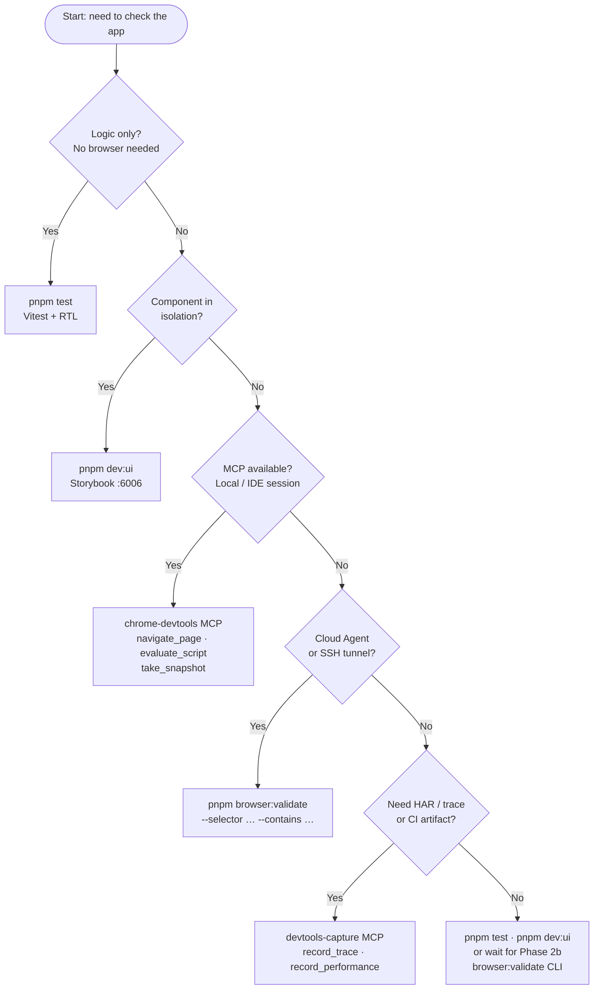

# Browser Validation

How to check that the app renders correctly and how to capture DevTools artifacts.
These are two separate concerns with separate tools — pick the right tier.

---

## Verify vs Capture

| Concept     | Industry terms                             | Role                                   | Artifacts | Tools                                             |
| ----------- | ------------------------------------------ | -------------------------------------- | --------- | ------------------------------------------------- |
| **Verify**  | drive + verify, live UI checks, assertions | Read DOM, assert text, check selector  | None      | `chrome-devtools` MCP, `pnpm browser:validate`    |
| **Capture** | instrumentation, tracing, DevTools capture | HAR, traces, Web Vitals, console dumps | Yes (CI)  | `devtools-capture` MCP, `copilot-devtools.js` CLI |

> **Rule:** Never use capture tools for routine verification. Never use verify tools when a CI
> artifact is needed.

---

## Decision Flowchart



---

## Agent Decision Table

Pick the **lightest** path that answers the question. Work top to bottom and stop at the first row
that fits.

| Goal                                                     | Use                                                                         | Avoid                                |
| -------------------------------------------------------- | --------------------------------------------------------------------------- | ------------------------------------ |
| Component logic, hooks, pure functions                   | `pnpm test` (Vitest + RTL)                                                  | Any browser process                  |
| Component UI in isolation                                | `pnpm dev:ui` → Storybook `http://localhost:6006`                           | Full app unless integration matters  |
| Assert text / DOM / selector (MCP available)             | `chrome-devtools` MCP — `navigate_page`, `evaluate_script`, `take_snapshot` | `record_trace`, `record_performance` |
| Assert text / DOM / selector (no MCP — Cloud Agent, SSH) | `pnpm browser:validate --selector … --contains …`                           | Raw one-off Playwright scripts       |
| Record HAR, network, Web Vitals, trace for debugging     | `devtools-capture` MCP `record_trace` / `record_performance`                | `chrome-devtools` MCP (wrong tier)   |
| CI artifact, PR comment workflow                         | `devtools-capture` MCP + `.github/workflows/devtools.yml`                   | MCP (not available in CI)            |

---

## App URL

Do not store the app URL in `.env`. It depends on which bundler is running (`BUNDLER` in `.env`):

| `BUNDLER`     | Dev port |
| ------------- | -------- |
| `app-vite`    | 5173     |
| `app-webpack` | 8080     |
| `app-esbuild` | 8000     |

**Always pass `--url` explicitly** in `browser:validate` / `browser:read` examples and CI.
Use `http://localhost:<port>` for local dev, or a full deployed preview URL when validating remotely.

Phase 2b CLI URL resolution (when `--url` is omitted): `--url` flag → optional `APP_URL` env var
(CI/deployed only) → derive `http://localhost:<port>` from `BUNDLER` → error with port table.

---

## Environment Scenarios

### Scenario 1 — Local dev (IDE with MCP)

Chrome and the app run on the same machine as the IDE. MCP servers are available.

```bash
# 1. Start the app (port follows BUNDLER — see App URL table above)
pnpm dev:app

# 2. Start Chrome with remote debugging
pnpm chrome:debug                 # opens Chrome on port 9222

# 3. Use MCP in your agent session
# chrome-devtools MCP → navigate_page url="http://localhost:<port>", evaluate_script, take_snapshot
# devtools-capture MCP → record_trace, record_performance (only when you need artifacts)
```

Relevant `.env` variables:

```
BUNDLER=app-vite
CHROME_DEBUG_PORT=9222
CHROME_DEBUG_HOST=localhost
```

---

### Scenario 2 — Remote / deployed URL

The app is deployed (staging, Netlify preview). The _target URL_ is remote, but both MCP servers
still connect to `localhost:9222` — Chrome must run locally with remote debugging enabled.

```bash
# 1. Start Chrome locally (as normal)
pnpm chrome:debug                 # opens Chrome on port 9222

# 2. Use chrome-devtools MCP with the deployed URL:
# navigate_page url="https://your-preview.netlify.app"

# 3. Or capture a trace with devtools-capture MCP:
# record_trace url="https://your-preview.netlify.app" duration=5
```

Pass the deployed URL directly — no `.env` URL variable needed:

```bash
pnpm browser:validate --url https://your-preview.netlify.app --selector body
```

Relevant `.env` variables (Chrome only):

```
CHROME_DEBUG_PORT=9222
CHROME_DEBUG_HOST=localhost
```

---

### Scenario 3a — Cloud Agent (headless VM, no MCP)

Everything runs on the same remote VM: the agent, Chrome, and the dev server. MCP is not
available. Use `pnpm browser:validate` which drives Chrome over CDP directly.

```bash
# All commands run on the Cloud Agent VM:

# 1. Start Chrome headlessly (no display required)
CHROME_HEADLESS=true pnpm chrome:debug

# 2. Start the app (port follows BUNDLER)
pnpm dev:app

# 3. Assert selectors (exit 0 = pass, exit 1 = fail)
pnpm browser:validate --url http://localhost:<port> --selector "[data-testid=app-header]"

# 4. Assert visible text
pnpm browser:validate --url http://localhost:<port> --selector "h1" --contains "Welcome"

# 5. Read DOM content as JSON
pnpm browser:read --url http://localhost:<port> --selector "body" --json
```

Environment variables (set on the VM):

```
BUNDLER=app-vite
CHROME_DEBUG_HOST=localhost
CHROME_DEBUG_PORT=9222
CHROME_HEADLESS=true
```

---

### Scenario 3b — SSH tunnel (Chrome on remote, commands from local)

Chrome runs on a remote machine; you want to run `browser:validate` assertions from your local
machine through an SSH tunnel. MCP may or may not be available locally.

```bash
# On the remote machine — start Chrome with remote debugging:
pnpm chrome:debug                 # listens on port 9222 of the remote host

# On your local machine — open the SSH tunnel:
ssh -L 9222:localhost:9222 user@remote-host

# Now run assertions locally — they connect through the tunnel to the remote Chrome.
# Use the URL where the app is reachable from your machine (remote host + app port):
pnpm browser:validate --url http://<remote-host>:<port> --selector "[data-testid=app-header]"
```

Environment variables (local machine, after tunnel is open):

```
CHROME_DEBUG_HOST=localhost
CHROME_DEBUG_PORT=9222
```

---

## Chrome Debug Commands

```bash
pnpm chrome:debug            # start Chrome with remote debugging on port 9222
pnpm chrome:debug:status     # check if Chrome is running
pnpm chrome:debug:stop       # stop Chrome

# Custom port
CHROME_DEBUG_PORT=9223 pnpm chrome:debug

# Headless mode (useful for CI or Cloud Agents)
CHROME_HEADLESS=true pnpm chrome:debug
```

---

## browser:validate / browser:read Reference

> **Note:** These commands become available in Phase 2b. Until then, use the `chrome-devtools` MCP
> for local verification or check the Storybook for component-level validation.

```bash
# Assert selector exists (--url required; <port> from App URL table)
pnpm browser:validate --url http://localhost:<port> --selector <css>

# Assert selector exists and contains text
pnpm browser:validate --url http://localhost:<port> --selector <css> --contains <text>

# Read selector content as JSON
pnpm browser:read --url http://localhost:<port> --selector <css> --json

# Deployed preview — pass the full URL
pnpm browser:validate --url https://your-preview.netlify.app --selector <css>
```

When `--url` is omitted (Phase 2b): CLI resolves `APP_URL` if set, else derives from `BUNDLER`.

Exit codes: `0` = assertion passed, `1` = assertion failed or error.

---

## Selector Stability Convention

Prefer selectors in this order (most stable → least stable):

1. `[data-testid=…]` — explicit test contract; kebab-case values
2. `[aria-label=…]` — accessible name; second choice
3. Role + accessible name (`[role=button][aria-label=…]`)
4. CSS class — last resort; documented as less stable

See `docs/component-validation-contract.md` for the full convention (added in Phase 3).

---

## Related Files

| File                                    | Purpose                                      |
| --------------------------------------- | -------------------------------------------- |
| `skills/browser-validation/SKILL.md`    | Agent entry point — read this first          |
| `skills/chrome-devtools/SKILL.md`       | Capture-only skill (HAR, traces, Web Vitals) |
| `docs/component-validation-contract.md` | `data-testid` convention (Phase 3)           |
| `.cursor/mcp.json`                      | MCP server configuration                     |
| `scripts/chrome-debug.js`               | Chrome lifecycle manager                     |
