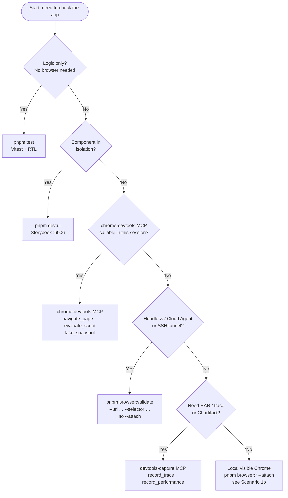

# Browser Validation

How to check that the app renders correctly and how to capture DevTools artifacts.
These are two separate concerns with separate tools — pick the right tier.

---

## Verify vs Capture

| Concept     | Industry terms                             | Role                                   | Artifacts | Tools                                             |
| ----------- | ------------------------------------------ | -------------------------------------- | --------- | ------------------------------------------------- |
| **Verify**  | drive + verify, live UI checks, assertions | Read DOM, assert text, check selector  | None      | `chrome-devtools` MCP, `pnpm browser:validate`    |
| **Capture** | instrumentation, tracing, DevTools capture | HAR, traces, Web Vitals, console dumps | Yes (CI)  | `devtools-capture` MCP, `copilot-devtools.js` CLI |

> **Rule:** Never use capture tools for routine verification. Never use verify tools when a CI
> artifact is needed.

---

## Decision Flowchart



---

## App URL

Do not store the app URL in `.env`. It depends on which bundler is running (`BUNDLER` in `.env`).

Each bundler app declares its own port as `devPort` / `previewPort` in its `package.json`
(e.g. `apps/app-vite/package.json`). That is the single source of truth — bundler configs and
browser tooling all read from it.

| `BUNDLER`     | Dev port | Preview port |
| ------------- | -------- | ------------ |
| `app-vite`    | 5173     | 4173         |
| `app-webpack` | 8080     | 8080         |
| `app-esbuild` | 8000     | 8000         |

**Agents:** pass `--url` explicitly in `browser:validate` / `browser:read` examples.
**CI/scripts:** may omit `--url` and rely on fallback resolution below.

Use `http://localhost:<devPort>` for local dev (`pnpm dev:app`), `http://localhost:<previewPort>` after
`pnpm preview:app`, or a full deployed preview URL when validating remotely.

CLI URL resolution (when `--url` is omitted): `--url` flag → optional `APP_URL` env var
(CI/deployed only) → derive `http://localhost:<devPort>` from `apps/<BUNDLER>/package.json` → error.

---

## Environment Scenarios

### Scenario 1 — MCP available in session

`chrome-devtools` MCP tools (`navigate_page`, `evaluate_script`, `take_snapshot`) are callable. Chrome and the app can be local or remote.

```bash
# 1. Start the app (port follows BUNDLER — see App URL table above)
pnpm dev:app

# 2. Start Chrome with remote debugging
pnpm chrome:debug                 # opens Chrome on port 9222

# 3. Use MCP in your agent session
# chrome-devtools MCP → navigate_page url="http://localhost:<port>", evaluate_script, take_snapshot
# devtools-capture MCP → record_trace, record_performance (only when you need artifacts)
```

Relevant `.env` variables:

```
BUNDLER=app-vite
CHROME_DEBUG_PORT=9222
CHROME_DEBUG_HOST=localhost
```

---

### Scenario 1b — No MCP, visible Chrome (local co-dev)

MCP tools are not available in this session. You and the agent share one visible Chrome window.
You navigate and authenticate manually; the agent inspects the current page without resetting
session state.

```bash
# 1. Start the app
pnpm dev:app

# 2. Start visible Chrome only if not already running (required_permissions: ["all"])
curl -sf http://localhost:9222/json/version || pnpm chrome:debug

# 3. Agent opens the app in that window
pnpm browser:open --url http://localhost:<port>

# 4. You navigate — log in, click to the screen under test

# 5. Agent inspects whatever is currently shown (does not navigate)
pnpm browser:snapshot --url http://localhost:<port> --attach
pnpm browser:validate --url http://localhost:<port> --selector "[data-testid=app-header]" --attach
pnpm browser:read --url http://localhost:<port> --selector "[data-testid=app-header]" --attach

# 6. Agent edits components → HMR updates the same tab → re-run --attach checks
```

**`--attach` rules:**

- Matches by **origin** (`http://localhost:<port>`), not exact path — any tab at that origin qualifies.
- Does **not** navigate — inspects the tab as the user left it.
- Requires a tab already open at that origin (`browser:open` or manual navigation). Errors with a
  hint if none is found.
- **Do not use in headless/CI/Cloud Agent** — use the default CLI mode instead (Scenario 3a).

**Default CLI (no `--attach`)** still applies for automated checks: each command opens a fresh
isolated context, navigates to `--url`, and closes. No shared auth.

---

### Scenario 2 — Remote / deployed URL

The app is deployed (staging, Netlify preview). The _target URL_ is remote, but both MCP servers
still connect to `localhost:9222` — Chrome must run locally with remote debugging enabled.

```bash
# 1. Start Chrome locally (as normal)
pnpm chrome:debug                 # opens Chrome on port 9222

# 2. Use chrome-devtools MCP with the deployed URL:
# navigate_page url="https://your-preview.netlify.app"

# 3. Or capture a trace with devtools-capture MCP:
# record_trace url="https://your-preview.netlify.app" duration=5
```

Pass the deployed URL directly — no `.env` URL variable needed:

```bash
pnpm browser:validate --url https://your-preview.netlify.app --selector body
```

Relevant `.env` variables (Chrome only):

```
CHROME_DEBUG_PORT=9222
CHROME_DEBUG_HOST=localhost
```

---

### Scenario 3a — Cloud Agent (headless VM, no MCP)

Everything runs on the same remote VM: the agent, Chrome, and the dev server. MCP is not
available. Use `pnpm browser:validate` which drives Chrome over CDP directly. **Do not use
`--attach`** — there is no shared visible tab; default isolated sessions are correct here.

```bash
# All commands run on the Cloud Agent VM:

# 1. Start Chrome headlessly (no display required)
CHROME_HEADLESS=true pnpm chrome:debug

# 2. Start the app (port follows BUNDLER)
pnpm dev:app

# 3. Assert selectors (exit 0 = pass, exit 1 = fail)
pnpm browser:validate --url http://localhost:<port> --selector "[data-testid=app-header]"

# 4. Assert visible text
pnpm browser:validate --url http://localhost:<port> --selector "h1" --contains "Welcome"

# 5. Read DOM content as JSON
pnpm browser:read --url http://localhost:<port> --selector "body" --json
```

Environment variables (set on the VM):

```
BUNDLER=app-vite
CHROME_DEBUG_HOST=localhost
CHROME_DEBUG_PORT=9222
CHROME_HEADLESS=true
```

---

### Scenario 3b — SSH tunnel (Chrome on remote, commands from local)

Chrome runs on a remote machine; you want to run `browser:validate` assertions from your local
machine through an SSH tunnel. MCP may or may not be available locally.

```bash
# On the remote machine — start Chrome with remote debugging:
pnpm chrome:debug                 # listens on port 9222 of the remote host

# On your local machine — open the SSH tunnel:
ssh -L 9222:localhost:9222 user@remote-host

# Now run assertions locally — they connect through the tunnel to the remote Chrome.
# Use the URL where the app is reachable from your machine (remote host + app port):
pnpm browser:validate --url http://<remote-host>:<port> --selector "[data-testid=app-header]"
```

Environment variables (local machine, after tunnel is open):

```
CHROME_DEBUG_HOST=localhost
CHROME_DEBUG_PORT=9222
```

---

## Chrome Debug Commands

```bash
pnpm chrome:debug            # start Chrome with remote debugging on port 9222
pnpm chrome:debug:status     # check if Chrome is running
pnpm chrome:debug:stop       # stop Chrome

# Custom port
CHROME_DEBUG_PORT=9223 pnpm chrome:debug

# Headless mode (useful for CI or Cloud Agents)
CHROME_HEADLESS=true pnpm chrome:debug
```

> **Sandbox note:** `chrome:*` lifecycle commands use `kill -0` internally, which is blocked in
> Cursor's sandboxed agent shell. Always run them with `required_permissions: ["all"]`. The port
> (`http://localhost:9222/json/version`) is the authoritative liveness check — `chrome:debug:status`
> is supplementary and can return a false "stale" result in sandboxed environments.

---

## browser-tools CLI

Command syntax, flags, env vars, and URL resolution:
[`packages/browser-tools/README.md`](../packages/browser-tools/README.md).

### Default vs `--attach`

|                                | Default (no `--attach`)                             | `--attach`                                |
| ------------------------------ | --------------------------------------------------- | ----------------------------------------- |
| **When**                       | Headless, CI, Cloud Agent, SSH, any automated check | Local co-dev with visible Chrome          |
| **Session**                    | New isolated context per command                    | Existing visible tab                      |
| **Navigation**                 | Always goes to `--url`                              | Does not navigate — inspects current page |
| **Auth / cookies**             | Fresh (empty)                                       | Preserved                                 |
| **Needs `browser:open` first** | No                                                  | Yes (or user opened the tab manually)     |
| **Chrome mode**                | `CHROME_HEADLESS=true` OK                           | Visible Chrome (`pnpm chrome:debug`)      |

Commands supporting `--attach`: `validate`, `read`, `eval`, `screenshot`, `snapshot`.
`browser:open` is separate — it navigates the visible window to a URL.

Design token and Figma-adjacent checks:
[`docs/design-spec-validation.md`](design-spec-validation.md).

---

## Selector Stability Convention

Prefer selectors in this order (most stable → least stable):

1. `[data-testid=…]` — explicit test contract; kebab-case values
2. `[aria-label=…]` — accessible name; second choice
3. Role + accessible name (`[role=button][aria-label=…]`)
4. CSS class — last resort; documented as less stable

See `docs/component-validation-contract.md` for the full convention.

---

## Storybook validation

Storybook (`pnpm dev:ui`, port `6006`) and the live bundler app are **different verification
targets**. Do not use `verify-browser-smoke.yml` for Storybook.

| Target                          | CI / regression                                                                                                                        | Agent / local spot-check                        |
| ------------------------------- | -------------------------------------------------------------------------------------------------------------------------------------- | ----------------------------------------------- |
| `packages/ui` in Storybook      | **Chromatic** — `@chromatic-com/storybook` addon in `apps/ui-storybook` (no CI workflow yet; run Chromatic manually or add a workflow) | `pnpm browser:read` against canvas URLs (below) |
| `packages/app-core` in live app | `.github/workflows/verify-browser-smoke.yml`                                                                                           | `pnpm browser:validate`                         |

The Chromatic addon is installed for visual regression when you wire it up; there is no automated
Chromatic job in `.github/workflows/` today. `browser:read` is not a Chromatic replacement — it is the
lightweight verify tier for agents when Storybook is already running locally.

**Scope:** `packages/app-core` components are **not** in Storybook. Assert them against the live app
(`browser:validate` or `verify-browser-smoke.yml`), not Storybook URLs. See
`docs/component-validation-contract.md`.

### Storybook URL (agents)

Do not store Storybook URLs in `.env` — port `6006` is declared as `devPort` in
`apps/ui-storybook/package.json`. Always pass `--url` explicitly.

`browser:validate` / `browser:read` query the **top-level page** — they do not pierce Storybook's
manager iframe. Use the **canvas URL** (Storybook's official E2E pattern), not the manager UI:

```text
http://localhost:6006/iframe.html?id=<story-id>
```

Do **not** use `?path=/story/…` for CLI verification — that loads the manager shell.

Story IDs derive from the story `title` and export name: `Example/DynamicList` + `Default` →
`example-dynamiclist--default`.

```bash
# 1. Start Storybook
pnpm dev:ui

# 2. Start Chrome (if not already running)
pnpm chrome:debug

# 3. Read a story canvas (packages/ui — use class or data-testid from story args)
pnpm browser:read \
  --url "http://localhost:6006/iframe.html?id=example-dynamiclist--default" \
  --selector ".DynamicList" \
  --json
```

---

## Related Files

| File                                          | Purpose                                                      |
| --------------------------------------------- | ------------------------------------------------------------ |
| `AGENTS.md`                                   | Canonical agent setup, ports, and commands                   |
| `.cursor/skills/_browser-validation/SKILL.md` | Agent entry point — read this first                          |
| `.cursor/skills/_browser-capture/SKILL.md`    | Capture-only skill (HAR, traces, Web Vitals)                 |
| `docs/component-validation-contract.md`       | `data-testid` convention                                     |
| `packages/browser-tools/README.md`            | Verify CLI reference (`browser:validate`, `browser:eval`, …) |
| `docs/design-spec-validation.md`              | Token/layout spec checks via `browser:eval`                  |
| `packages/browser-capture/README.md`          | Capture CLI and MCP tool reference                           |
| `.cursor/mcp.json`                            | MCP server configuration                                     |
| `scripts/check-mcp-config.mjs`                | Keeps `.cursor/mcp.json` and `.vscode/mcp.json` in sync      |
| `packages/browser-tools/bin/chrome.js`        | Chrome lifecycle manager                                     |
| `.github/workflows/verify-browser-smoke.yml`  | CI live-app smoke (verify tier)                              |
| `.github/workflows/capture-devtools.yml`      | CI capture-snapshot (capture tier)                           |
